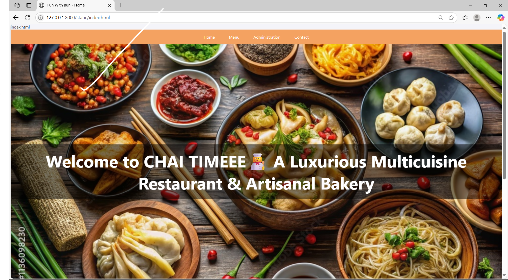
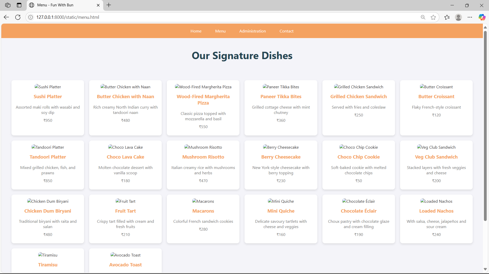
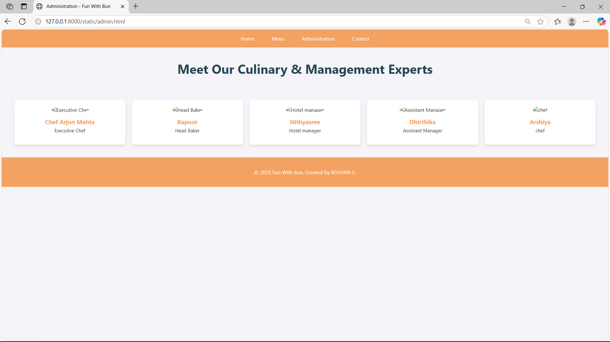
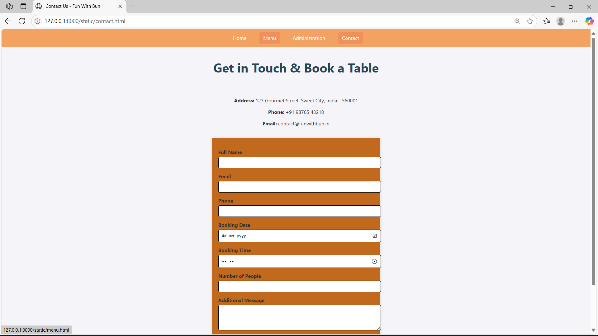

# Ex.07 Restaurant Website
## Date:22.5.25

## AIM:
To develop a static Restaurant website to display the food items and services provided by them.

## DESIGN STEPS:

### Step 1:
Requirement collection.

### Step 2:
Creating the layout using HTML and CSS.

### Step 3:
Updating the sample content.

### Step 4:
Choose the appropriate style and color scheme.

### Step 5:
Validate the layout in various browsers.

### Step 6:
Validate the HTML code.

### Step 7:
Publish the website in the given URL.

## PROGRAM:
```
/* Global Styles */
body, html {
  margin: 0;
  padding: 0;
  font-family: 'Segoe UI', sans-serif;
  background-color: #f4f4f9;
  color: #333;
}

h2.title {
  font-size: 2.5em;
  color: #264653;
  margin-top: 40px;
  text-align: center;
}

footer {
  background-color: #f4a261;
  color: white;
  padding: 20px;
  text-align: center;
}

a {
  text-decoration: none;
  color: inherit;
}

/* Navigation Bar */
.nav {
  display: flex;
  justify-content: center;
  background-color: #f4a261;
  padding: 10px 0;
  position: sticky;
  top: 0;
  z-index: 1000;
}

.nav a {
  color: white;
  text-decoration: none;
  margin: 0 15px;
  padding: 8px 12px;
  border-radius: 4px;
  transition: background 0.3s ease;
}

.nav a:hover {
  background-color: #e76f51;
}

/* Hero Section */
.hero {
  position: relative;
  height: 100vh;
  background: url('images/banner.jpg') no-repeat center center/cover;
  display: flex;
  justify-content: center;
  align-items: center;
  text-align: center;
  color: white;
  animation: fadeIn 2s ease-in-out;
}

.hero h1 {
  font-size: 4em;
  background: rgba(0, 0, 0, 0.5);
  padding: 20px;
  border-radius: 10px;
  animation: slideInDown 1.5s ease-out;
}

@keyframes slideInDown {
  from {
    transform: translateY(-100px);
    opacity: 0;
  }
  to {
    transform: translateY(0);
    opacity: 1;
  }
}

@keyframes fadeIn {
  from {
    opacity: 0;
  }
  to {
    opacity: 1;
  }
}

/* Menu Page Styles */
.menu-grid {
  display: grid;
  grid-template-columns: repeat(auto-fit, minmax(250px, 1fr));
  gap: 20px;
  padding: 40px;
}

.card {
  background-color: #fff;
  border-radius: 10px;
  box-shadow: 0 4px 8px rgba(0, 0, 0, 0.1);
  padding: 15px;
  text-align: center;
}

.card img {
  width: 100%;
  height: 180px;
  object-fit: cover;
  border-radius: 8px;
}

.card h3 {
  margin-top: 15px;
  color: #f4a261;
}

.card p {
  color: #777;
  margin: 10px 0;
}

/* Contact Form Styles */
.contact-form {
  max-width: 500px;
  margin: 40px auto;
  background-color: #fff;
  padding: 20px;
  border-radius: 10px;
  box-shadow: 0 0 10px rgba(0, 0, 0, 0.1);
}

.contact-form label {
  display: block;
  margin-top: 15px;
  font-weight: bold;
}

.contact-form input,
.contact-form textarea {
  width: 100%;
  padding: 10px;
  margin-top: 5px;
  border: 1px solid #ccc;
  border-radius: 5px;
}

.contact-form button {
  margin-top: 20px;
  padding: 10px 20px;
  background-color: #f4a261;
  color: white;
  border: none;
  border-radius: 5px;
  cursor: pointer;
}

.contact-form button:hover {
  background-color: #e76f51;
}

/* Admin Page Styles */
.admin-grid {
  display: grid;
  grid-template-columns: repeat(auto-fit, minmax(250px, 1fr));
  gap: 20px;
  padding: 40px;
  text-align: center;
}

.admin-card {
  background-color: #fff;
  border-radius: 10px;
  box-shadow: 0 4px 8px rgba(0, 0, 0, 0.1);
  padding: 20px;
}

.admin-card img {
  width: 120px;
  height: 120px;
  object-fit: cover;
  border-radius: 50%;
  margin-bottom: 15px;
}

.admin-card h3 {
  margin: 0;
  color: #f4a261;
}

.admin-card p {
  margin-top: 5px;
  font-size: 0.95rem;
}

/* Highlights Section */
.highlights {
  display: flex;
  flex-wrap: wrap;
  padding: 40px;
  justify-content: space-around;
  background: #fff3e6;
}

.highlight-card {
  width: 300px;
  margin: 20px;
  background: #fff;
  border-radius: 10px;
  box-shadow: 0 8px 16px rgba(0, 0, 0, 0.1);
  overflow: hidden;
  transition: transform 0.3s ease;
}

.highlight-card:hover {
  transform: translateY(-10px);
}

.highlight-card img {
  width: 100%;
  height: 200px;
  object-fit: cover;
}

.highlight-card h3 {
  margin: 10px;
  color: #264653;
}

```
```
<!-- menu.html -->
<!DOCTYPE html>
<html lang="en">
<head>
  <meta charset="UTF-8">
  <meta name="viewport" content="width=device-width, initial-scale=1.0">
  <title>Menu - Fun With Bun</title>
  <link rel="stylesheet" href="style.css">
  <style>
    .menu-grid {
      display: grid;
      grid-template-columns: repeat(auto-fit, minmax(250px, 1fr));
      gap: 20px;
      padding: 40px;
    }
    .card {
      background-color: #fff;
      border-radius: 10px;
      box-shadow: 0 4px 8px rgba(0,0,0,0.1);
      padding: 15px;
      text-align: center;
    }
    .card img {
      width: 100%;
      height: 180px;
      object-fit: cover;
      border-radius: 8px;
    }
    .card h3 {
      margin-top: 15px;
      color: #f4a261;
    }
  </style>
</head>
<body>
     <div class="nav">
    <a href="index.html">Home</a>
    <a href="menu.html">Menu</a>
    <a href="admin.html">Administration</a>
    <a href="contact.html">Contact</a>
  </div>
  <h2 class="title">Our Signature Dishes</h2>
  <div class="menu-grid">
    <div class="card">
      
      <h3>Sushi Platter</h3>
      <p>Assorted maki rolls with wasabi and soy dip</p>
      <p>₹950</p>
    </div>
    <div class="card">
      
      <h3>Butter Chicken with Naan</h3>
      <p>Rich creamy North Indian curry with tandoori naan</p>
      <p>₹480</p>
    </div>
    <div class="card">
      
      <h3>Wood-Fired Margherita Pizza</h3>
      <p>Classic pizza topped with mozzarella and basil</p>
      <p>₹550</p>
    </div>
    <div class="card">
      
      <h3>Paneer Tikka Bites</h3>
      <p>Grilled cottage cheese with mint chutney</p>
      <p>₹360</p>
    </div>
    <div class="card">
      
      <h3>Grilled Chicken Sandwich</h3>
      <p>Served with fries and coleslaw</p>
      <p>₹250</p>
    </div>
    <div class="card">
      
      <h3>Butter Croissant</h3>
      <p>Flaky French-style croissant</p>
      <p>₹120</p>
    </div>
    <div class="card">
      
      <h3>Tandoori Platter</h3>
      <p>Mixed grilled chicken, fish, and prawns</p>
      <p>₹850</p>
    </div>
    <div class="card">
      
      <h3>Choco Lava Cake</h3>
      <p>Molten chocolate dessert with vanilla scoop</p>
      <p>₹180</p>
    </div>
    <div class="card">
      
      <h3>Mushroom Risotto</h3>
      <p>Italian creamy rice with mushrooms and herbs</p>
      <p>₹470</p>
    </div>
    <div class="card">
      
      <h3>Berry Cheesecake</h3>
      <p>New York-style cheesecake with berry topping</p>
      <p>₹230</p>
    </div>
    <div class="card">
      
      <h3>Choco Chip Cookie</h3>
      <p>Soft-baked cookie with melted chocolate chips</p>
      <p>₹50</p>
    </div>
    <div class="card">
      
      <h3>Veg Club Sandwich</h3>
      <p>Stacked layers with fresh veggies and cheese</p>
      <p>₹200</p>
    </div>
    <div class="card">
      
      <h3>Chicken Dum Biryani</h3>
      <p>Traditional biryani with raita and salan</p>
      <p>₹480</p>
    </div>
    <div class="card">
      
      <h3>Fruit Tart</h3>
      <p>Crispy tart filled with cream and fresh fruits</p>
      <p>₹210</p>
    </div>
    <div class="card">
      
      <h3>Macarons</h3>
      <p>Colorful French sandwich cookies</p>
      <p>₹280</p>
    </div>
    <div class="card">
      
      <h3>Mini Quiche</h3>
      <p>Delicate savoury tartlets with cheese and veggies</p>
      <p>₹160</p>
    </div>
    <div class="card">
      
      <h3>Chocolate Éclair</h3>
      <p>Choux pastry with chocolate glaze and cream filling</p>
      <p>₹190</p>
    </div>
    <div class="card">
      
      <h3>Loaded Nachos</h3>
      <p>With salsa, cheese, jalapeños and sour cream</p>
      <p>₹240</p>
    </div>
    <div class="card">
      
      <h3>Tiramisu</h3>
      <p>Italian layered dessert with coffee and mascarpone</p>
      <p>₹300</p>
    </div>
    <div class="card">
      
      <h3>Avocado Toast</h3>
      <p>Toasted sourdough with smashed avocado and seeds</p>
      <p>₹270</p>
    </div>
  </div>

  <footer>
    <p>&copy; 2025 Fun With Bun. Created by NITHYASREE.</p>
  </footer>
</body>
</html>


```
```
index.html

<!-- index.html -->
<!DOCTYPE html>
<html lang="en">
<head>
  <meta charset="UTF-8">
  <meta name="viewport" content="width=device-width, initial-scale=1.0">
  <title>Fun With Bun - Home</title>
  <link rel="stylesheet" href="style.css">
  <style>
    body, html {
      margin: 0;
      padding: 0;
      font-family: 'Segoe UI', sans-serif;
      overflow-x: hidden;
    }
    .hero {
      position: relative;
      height: 100vh;
      background: url('https://as1.ftcdn.net/v2/jpg/11/36/09/82/1000_F_1136098230_TIg7LlstcM8cmpqQqVhaOMRAMZbNHgZI.jpg') no-repeat center center/cover;
      display: flex;
      justify-content: center;
      align-items: center;
      text-align: center;
      color: white;
      animation: fadeIn 2s ease-in-out;
    }
    .hero h1{
      font-size: 4em;
      background: rgba(0, 0, 0, 0.5);
      padding: 20px;
      border-radius: 10px;
      animation: slideInDown 1.5s ease-out;
    }
    .nav {
      display: flex;
      justify-content: center;
      background-color: #f4a261;
      padding: 10px 0;
      position: sticky;
      top: 0;
      z-index: 1000;
    }
    .nav a {
      color: white;
      text-decoration: none;
      margin: 0 15px;
      padding: 8px 12px;
      border-radius: 4px;
      transition: background 0.3s ease;
    }
    .nav a:hover {
      background-color: #e76f51;
    }
    .highlights {
      display: flex;
      flex-wrap: wrap;
      padding: 40px;
      justify-content: space-around;
      background: #fff3e6;
    }
    .highlight-card {
      width: 300px;
      margin: 20px;
      background: #fff;
      border-radius: 10px;
      box-shadow: 0 8px 16px rgba(0,0,0,0.1);
      overflow: hidden;
      transition: transform 0.3s ease;
    }
    .highlight-card:hover {
      transform: translateY(-10px);
    }
    .highlight-card img {
      width: 100%;
      height: 200px;
      object-fit: cover;
    }
    .highlight-card h3 {
      margin: 10px;
      color: #264653;
    }
    .highlight-card p {
      padding: 0 10px 10px;
      color: #555;
    }
    footer {
      text-align: center;
      background-color: #f4a261;
      color: white;
      padding: 20px;
    }

    @keyframes slideInDown {
      from {
        transform: translateY(-100px);
        opacity: 0;
      }
      to {
        transform: translateY(0);
        opacity: 1;
      }
    }
    @keyframes fadeIn {
      from {
        opacity: 0;
      }
      to {
        opacity: 1;
      }
    }
  </style>
</head>
<body>
  <div class="nav">
    <a href="index.html">Home</a>
    <a href="menu.html">Menu</a>
    <a href="admin.html">Administration</a>
    <a href="contact.html">Contact</a>
  </div>

  <section class="hero">
    <h1>Welcome to CHAI TIMEEE👩‍🍳 A Luxurious Multicuisine Restaurant & Artisanal Bakery</h1>
    
  </section>

  <section class="highlights">
    <div class="highlight-card">
      
      <h3>Signature Bun Treats</h3>
      <p>Delicious handcrafted buns with sweet and savory flavors.</p>
    </div>
    <div class="highlight-card">
      
      <h3>Gourmet Sandwiches</h3>
      <p>Fresh, filling, and perfect for a satisfying meal.</p>
    </div>
    <div class="highlight-card">
      
      <h3>Heavenly Desserts</h3>
      <p>End your meal with our irresistible sweets.</p>
    </div>
  </section>

  <footer>
    <p>&copy; 2025 Fun With Bun. Created by NITHYASREE.</p>
  </footer>
</body>
</html>

```
```
<!-- contact.html -->
<!DOCTYPE html>
<html lang="en">
<head>
  <meta charset="UTF-8">
  <meta name="viewport" content="width=device-width, initial-scale=1.0">
  <title>Contact Us - Fun With Bun</title>
  <link rel="stylesheet" href="style.css">
  <style>
    .contact-form {
      max-width: 500px;
      margin: 0 auto;
      background-color:#c16a1e;
      padding: 20px;
      border-radius: 3px;
      box-shadow: 0 0 10px rgba(0, 0, 0, 0.1);
    }
    .contact-form label {
      display: block;
      margin-top: 15px;
      font-weight: bold;
    }
    .contact-form input, .contact-form textarea {
      width: 100%;
      padding: 10px;
      margin-top: 5px;
      border: 1px solid black;
      border-radius: 5px;
    }
    .contact-form button {
      margin-top: 20px;
      padding: 10px 20px;
      background-color: #b0a03e;
      color: rgb(37, 61, 117);
      border: none;
      border-radius: 5px;
      cursor: pointer;
    }
    .contact-form button:hover {
      background-color: #b05c48;
    }
  </style>
</head>
<body>
     <div class="nav">
    <a href="index.html">Home</a>
    <a href="menu.html">Menu</a>
    <a href="admin.html">Administration</a>
    <a href="contact.html">Contact</a>
  </div>
  <h2 class="title">Get in Touch & Book a Table</h2>
  <div style="text-align: center; padding: 20px;">
    <p><strong>Address:</strong> 123 Gourmet Street, Sweet City, India - 560001</p>
    <p><strong>Phone:</strong> +91 98765 43210</p>
    <p><strong>Email:</strong> contact@funwithbun.in</p>
  </div>

  <div class="contact-form">
    <form action="#" method="post">
      <label for="name">Full Name</label>
      <input type="text" id="name" name="name" required>

      <label for="email">Email</label>
      <input type="email" id="email" name="email" required>

      <label for="phone">Phone</label>
      <input type="tel" id="phone" name="phone" required>

      <label for="date">Booking Date</label>
      <input type="date" id="date" name="date" required>

      <label for="time">Booking Time</label>
      <input type="time" id="time" name="time" required>

      <label for="people">Number of People</label>
      <input type="number" id="people" name="people" min="1" max="20" required>

      <label for="message">Additional Message</label>
      <textarea id="message" name="message" rows="4"></textarea>

      <button type="submit">Book Now</button>
    </form>
  </div>

  <footer>
    <p>&copy; 2025 Fun With Bun. Created by NITHYASREE.</p>
  </footer>
</body>
</html>

```
```
<!-- admin.html -->
<!DOCTYPE html>
<html lang="en">
<head>
  <meta charset="UTF-8">
  <meta name="viewport" content="width=device-width, initial-scale=1.0">
  <title>Administration - Fun With Bun</title>
  <link rel="stylesheet" href="style.css">
  <style>
    .admin-grid {
      display: grid;
      grid-template-columns: repeat(auto-fit, minmax(250px, 1fr));
      gap: 20px;
      padding: 40px;
      text-align: center;
    }
    .admin-card {
      background-color: #fff;
      border-radius: 10px;
      box-shadow: 0 4px 8px rgba(0,0,0,0.1);
      padding: 20px;
    }
    .admin-card img {
      width: 120px;
      height: 120px;
      object-fit: cover;
      border-radius: 50%;
      margin-bottom: 15px;
    }
    .admin-card h3 {
      margin: 0;
      color: #f4a261;
    }
    .admin-card p {
      margin-top: 5px;
      font-size: 0.95rem;
    }
  </style>
</head>
 <div class="nav">
    <a href="index.html">Home</a>
    <a href="menu.html">Menu</a>
    <a href="admin.html">Administration</a>
    <a href="contact.html">Contact</a>
  </div>
<body>
  <h2 class="title">Meet Our Culinary & Management Experts</h2>
  <div class="admin-grid">
    <div class="admin-card">
      
      <h3>Chef Arjun Mehta</h3>
      <p>Executive Chef</p>
    </div>
    <div class="admin-card">
      
      <h3>Kapoor</h3>
      <p>Head Baker</p>
    </div>
    <div class="admin-card">
      
      <h3>Nithyasree</h3>
      <p>Hotel manager</p>
    </div>
    <div class="admin-card">
      
      <h3>Dhirthika</h3>
      <p>Assistant Manager</p>
    </div>
    <div class="admin-card">
      
      <h3>Arshiya</h3>
      <p>chef</p>
    </div>
    
  </div>
  <footer>
    <p>&copy; 2025 Fun With Bun. Created by ROSHINI S.</p>
  </footer>
</body>
</html>

```
## OUTPUT:






## RESULT:
The program for designing software company website using HTML and CSS is completed successfully.
